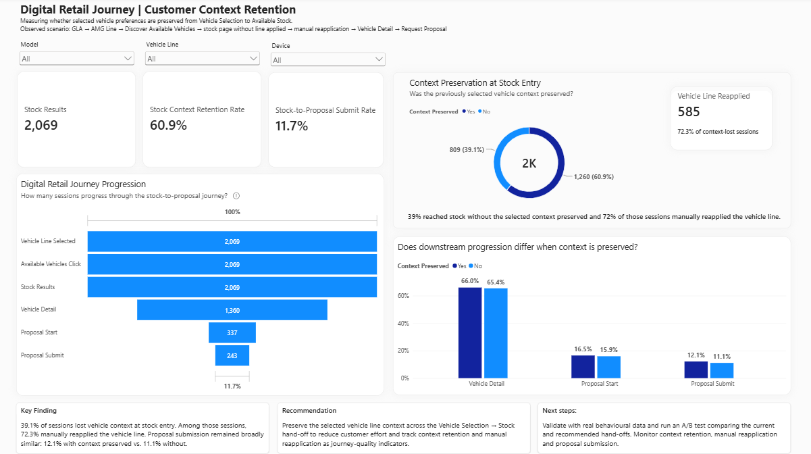

# Digital Retail Journey | Customer Context Retention

Power BI digital analytics case developed to analyse customer context retention across a digital retail journey, from vehicle selection to available stock and commercial intent.

The project was inspired by publicly observable behaviour on the Mercedes-Benz digital retail experience and uses synthetic behavioural data created exclusively for demonstration purposes.

The analysis focuses on whether selected vehicle preferences are preserved during the Vehicle Selection → Stock hand-off, how often customers need to manually reapply their preferences, and whether context preservation is associated with differences in downstream progression.

<a href="https://app.powerbi.com/view?r=eyJrIjoiNTJlNWI5ZmEtNjQ5MC00ZmYzLWJmZGItN2U3M2U2YjhlZTE1IiwidCI6IjM1ODAxOWMyLWZmMWQtNGRlOC04MDBlLTk2YTRkMzgwNzMwYyIsImMiOjl9" rel="nofollow">Click here to open the Digital Retail Journey</a>

## Key Insights

- Stock-entry sessions and progression through the main digital retail journey
- Context retention at the transition to available stock
- Manual vehicle-line reapplication after context loss
- Vehicle-detail progression
- Proposal start and submission rates
- Comparison of downstream progression between preserved and non-preserved context sessions

## Key Finding

In the synthetic scenario, a meaningful share of stock-entry sessions did not preserve the previously selected vehicle context, and many of those sessions manually reapplied the vehicle line. However, downstream proposal submission remained broadly similar between preserved and non-preserved sessions.

## Recommendation

Preserve the selected vehicle context across the Vehicle Selection → Stock hand-off to reduce unnecessary customer effort.

The commercial impact should be validated using real behavioural data before attributing conversion loss to this friction.

## Next Step

Implement context persistence and run an A/B test comparing the current and proposed hand-offs.

Monitor:
- Context retention
- Manual vehicle-line reapplication
- Vehicle-detail progression
- Proposal submission

## Measurement Approach

The project includes a proposed event-tracking framework designed for the analysis.

Example events include:

- `vehicle_line_select`
- `available_stock_click`
- `stock_results_view`
- `stock_line_filter_apply`
- `vehicle_detail_view`
- `proposal_start`
- `proposal_submit`

These event names are part of the proposed measurement plan and are not claimed to be Mercedes-Benz production analytics events.

## Data

Synthetic behavioural data generated to simulate realistic digital retail journeys for demonstration purposes.

## Tools

- Power BI
- DAX
- Power Query
- Data Modeling
- Digital Analytics
- Customer Journey Analysis
- Funnel Analysis
- Measurement Planning
- A/B Testing Framework

## Report Preview

